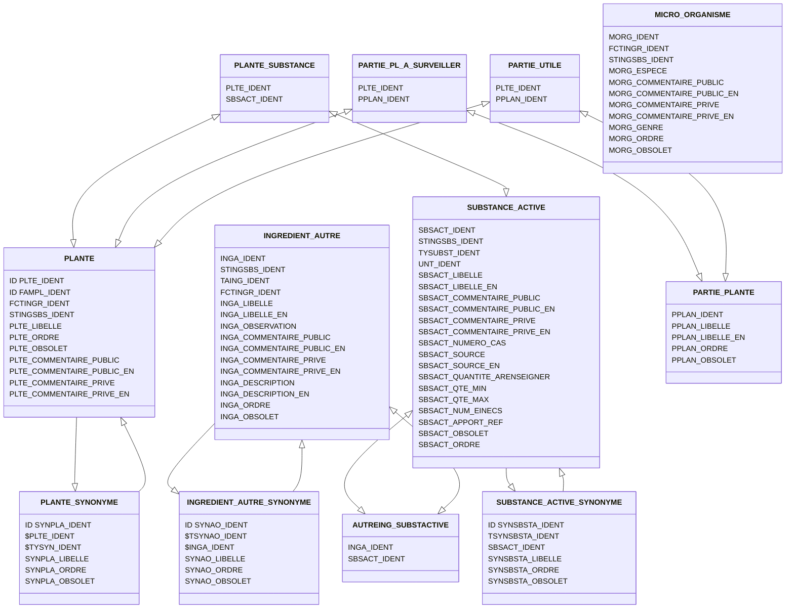

# Les données

## Tables mises à disposition par Téléicare
La séparation fonctionnelle entre ces différentes tables est soumise à modification au fur et à mesure de la compréhension.

### Elements
|nom de table | intégrée à compl-alim ?  |       |       |       |
|---    |:-:    |---   |:-:    |--:    |
| REF_ICA_PLANTE      |  ✅     |       |       |       |
|  REF_ICA_PLANTE_SYNONYME     |  ✅|       |       |       |
|  REF_ICA_PLANTE_SUBSTANCE     |✅|       |       |       |
|  REF_ICA_INGREDIENT_AUTRE     |      ✅      |       |       |       |
|  REF_ICA_INGREDIENT_AUTRE_SYNONYME     |     ✅       |       |       |       |
|  REF_ICA_AUTREING_SUBSTACTIVE     |     ✅       |       |       |       |
|  REF_ICA_SUBSTANCE_ACTIVE     |     ✅       |       |       |       |
|  REF_ICA_SUBSTANCE_ACTIVE_SYNONYME     |     ✅       |       |       |       |
|  REF_ICA_PARTIE_UTILE     | ✅ |       |       |       |
|  REF_ICA_PARTIE_PLANTE     |     ✅       |       |       |       |
|  REF_ICA_PARTIE_PL_A_SURVEILLER     |  ✅|       |       |       |
|  REF_ICA_MICRO_ORGANISME     | ✅ |       |       |       |
| REF_ICA_MICROORG_SUBSTACTIVE     |   TODO    |       |       |       |
|  REF_ICA_MICROORG_SYNONYME     |  TODO     |       |       |       |
|REF_ICA_TYPE_SYNONYME_AUTREING     |       |       |       |       |
|REF_ICA_TYPE_SYNONYME_MICROORG     |       |       |       |       |
|REF_ICA_TYPE_SYNONYME_PLANTE     |       |       |       |       |
|REF_ICA_TYPE_SYNONYME_SUBSTACTIVE     |       |       |       |       |
|REF_ICA_FAMILLE_PLANTE     |  TODO  |       |       |       |
|REF_ICA_TYPE_SUBSTANCE     |       |       |       |       |
REF_ICA_TYPE_INGREDIENT     |       |       |       |       |
REF_ICA_TYPE_AUTRE_INGREDIENT     |       |       |       |       |
REF_ICA_STATUT_INGR_SUBST     |       |       |       |       |
REF_ICA_STD_STATUT     |       |       |       |       |
REF_ICA_FONCTION_INGREDIENT     |       |       |       |       |

### Déclaration
|nom de table | intégrée à compl-alim ?  |       |       |       |
|---    |:-:    |---    |:-:    |--:    |
|ICA_PREPARATION     |       |       |       |       |
|REF_ICA_TYPE_PREPARATION     |       |       |       |       |
|ICA_INGREDIENT_AUTRE     |       |       |       |       |
|ICA_INGREDIENT     |       |       |       |       |
|ICA_MICRO_ORGANISME     |       |  contient les souches rentrées à la main jusqu'à maintenant     |       |       |
|ICA_POPULATION_CIBLE_DECLAREE     |       |       |       |       |
|ICA_POPULATION_RISQUE_DECLAREE     |       |       |       |       |
|ICA_SUBSTANCE_DECLAREE     |       |       |       |       |
|ICA_USAGER     |       |   anonymisée (contint Foreign Key vers USR, ADM, ETAB)   |       |       |
|REF_ICA_TYPE_TRACE     |       |       |       |       |
|REF_ICA_TYPE_EVENEMENT     |       |       |       |       |
|REF_ICA_TYPE_DECLARATION     |       |       |       |       |
|REF_ICA_TYPE_DOCUMENT     |       |       |       |       |
|REF_ICA_TYPE_HERITAGE     |       |       |       |       |
|REF_ICA_TYPE_USR_ENCOURS     |       |       |       |       |
|REF_ICA_TYPE_VERSION_DECLARATION     |       |       |       |       |
|ICA_VERSION_DECLARATION     |       |   concerne les MAJ de compléments ?    |       |       |
|ICA_VRSDECL_JUSTREF     |       |       |       |       |
|ICA_VRSDECL_PAYS_RESTRICTION     |       |    permet d'associer des ressources règlementaires à certains ingrédients dans des version_declaration   |       |       |
|REF_ICA_UNITE   |   Enum ?    |       |       |       |
|ICA_ADMINISTRATEUR   |       |       |       |       |
|ICA_COMPLEMENT_ALIMENTAIRE   |       |       |       |       |
|ICA_CONTACT   |       |       |       |       |
|ICA_DECLARATION_ISSU_DE   |       |       |       |       |
|ICA_DECLARATION   |       |       |       |       |
|ICA_DOCUMENTS   |       |       |       |       |
|ICA_EFFET_DECLARE   |       |       |       |       |
|ICA_ETABLISSEMENT   |       |       |       |       |
|ICA_ETS_CLIENT   |       |       |       |       |
|ICA_ETS_MANDATAIRE   |       |       |       |       |
|ICA_EVENEMENT_VERSION_DECLARATION   |       |       |       |       |
|REF_ICA_FORME_GALENIQUE   |       |       |       |       |
|REF_ICA_OBJECTIFS_EFFETS   |       |       |       |       |
|REF_ICA_POPULATION_ARISQUE   |       |       |       |       |
|REF_ICA_POPULATION_CIBLE   |       |       |       |       |
|REF_ICA_QTE_POPULATION   |       |       |       |       |
|REF_ICA_CIVILITE   |  Enum ?  |       |       |       |
|PAYS_ESPACE_EUROPEEN   |  Juste un boolean sur la table PAYS suffit  |       |       |       |
|PAYS   |    |       |       |       |

### Instruction
|nom de table | intégrée à compl-alim ?  |  commentaire     |       |       |
|---    |:-:    |---   |:-:    |--:    |
|REF_ICA_MOTIF_DE_REFUS     |       |       |       |       |
|REF_ICA_JUSTIFICATION_DE_REFUS     |       |       |       |       |
|REF_ICA_STATUT_DECLARATION     |       |       |       |       |
|REF_ICA_STADE_DECLARATION     |       |       |       |       |
|REF_ICA_STADE_EXAMEN_DECLARATION     |       |       |       |       |
|AGENT_DGCCRF     |       |   anonymisée sauf membre BEPIAS   |       |       |
|REF_ICA_JUSTIFICATION_DE_REFUS     |       |       |       |       |
|LST_DECLA_DELAI_DEPASSE     |  ❌   |  ⚠️ oubli d'anonymisation, contenu du mail de délai dépassé et adresse mail de contact.     |       |       |
|ICA_JSON_DECLARATION     |     |  Semble avoir été obfusqué ?     |       |       |

### Inspection

|nom de table | intégrée à compl-alim ?  |  commentaire     |       |       |
|---    |:-:    |---    |:-:    |--:    |
|UNITE_FONCTIONNELLE     |       |       |       |       |
|TYPE_UNITE_FONCTIONNELLE     |       |       |       |       |

### Autres

|nom de table | intégrée à compl-alim ?  |  commentaire     |       |       |
|---    |:-:    |---    |:-:    |--:    |
|COGIS     |       |       |       |       |
|REF_X_PFIL_PROFIL_AGENT     |       |       |       |       |
|REF_X_PFIL_PFIL_DROIT     |       |       |       |       |
|REF_X_PFIL_DROIT     |       |       |       |       |
|REF_X_PFIL_DOMAINE_APPLICATION     |       |       |       |       |
|REF_X_PFIL_APPLICATION     |       |       |       |       |
|REF_X_PFIL_AGREG_PROFIL     |       |       |       |       |
|REF_X_MEDIAPOST     |       |       |       |       |
|ICA_TRACE     | ❌ |  Fichier vide     |       |       |
|ICA_TraceMenageFichiers     | ❌ |  Fichier vide     |       |       |
|ICA_INSTANTANEADHESION     | ❌ |  Fichier vide -> vue ? sur les utilisateurs en cours d'adhésion     |       |       |
|ICA_INSTANTANEDECLARATION     | ❌ |  Vue probable ?     |       |       |
|ICA_INSTANTANEUSAGER     | ❌ |  Vue probable ?    |       |       |

## Modèle de TéléIcare

### 01/01/24

