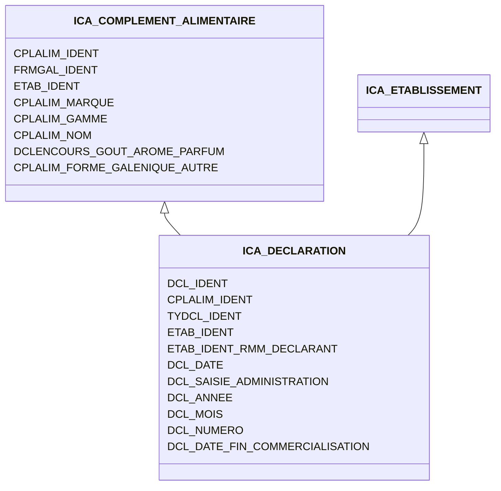

# Les données

## Tables mises à disposition par Téléicare
La séparation fonctionnelle entre ces différentes tables est soumise à modification au fur et à mesure de la compréhension.

### Elements
|nom de table|importée ?|modèle Django|commentaires|
|---    |:-:    |---   |---   |
|REF_ICA_PLANTE      |✅|Plant|       |
|REF_ICA_PLANTE_SYNONYME     |✅|PlantSynonym|       |
|REF_ICA_PLANTE_SUBSTANCE     |✅|PlantSubstanceRelation|       |
|REF_ICA_SUBSTANCE_ACTIVE     |✅|Substance|       |
|REF_ICA_SUBSTANCE_ACTIVE_SYNONYME     |✅|SubstanceSynonym|       |
|REF_ICA_INGREDIENT_AUTRE     |✅|Ingredient|       |
|REF_ICA_INGREDIENT_AUTRE_SYNONYME     |✅|IngredientSynonym|       |
|REF_ICA_AUTREING_SUBSTACTIVE     |✅|IngredientSubstanceRelation|       |
|REF_ICA_PARTIE_PLANTE     |✅|PlantPart|       |
|REF_ICA_PARTIE_UTILE     |✅|Part|       |
|REF_ICA_PARTIE_PL_A_SURVEILLER     |✅|Part|       |
|REF_ICA_MICRO_ORGANISME     |✅|Microorganism|       |
|REF_ICA_MICROORG_SYNONYME     |TODO|MicroorganismSynonym|       |
|REF_ICA_MICROORG_SUBSTACTIVE     |TODO|MicroorganismSubstanceRelation|       |
|REF_ICA_TYPE_SYNONYME_AUTREING     |       |       |       |
|REF_ICA_TYPE_SYNONYME_MICROORG     |       |       |       |
|REF_ICA_TYPE_SYNONYME_PLANTE     |       |       |       |
|REF_ICA_TYPE_SYNONYME_SUBSTACTIVE     |       |       |       |
|REF_ICA_FAMILLE_PLANTE     |TODO|PlantFamily|       |
|REF_ICA_TYPE_SUBSTANCE     |       |       |       |       |       |
REF_ICA_TYPE_INGREDIENT     |       |       |       |       |       |
REF_ICA_TYPE_AUTRE_INGREDIENT     |       |       |       |       |       |
REF_ICA_STATUT_INGR_SUBST     |       |       |       |       |       |
REF_ICA_STD_STATUT     |       |       |       |       |       |
REF_ICA_FONCTION_INGREDIENT     |       |       |       |       |       |
|REF_ICA_TYPE_PREPARATION     |       |       |       |

### Déclaration
|nom de table|importée ?|commentaires|
|---    |:-:    |---    |
|ICA_PREPARATION     |       |Relation entre chaque Plante utilisé dans une composition de complément alimentaire, une unité et une quantité|
|ICA_INGREDIENT_AUTRE     |       |       |
|ICA_INGREDIENT     |       |Contient tous les types d'éléments d'un complément alimentaire|
|ICA_MICRO_ORGANISME     |       |  contient le champ `souches` rentré à la main jusqu'à maintenant à intégrer dans Microorganism     |
|ICA_POPULATION_CIBLE_DECLAREE     |       |       |
|ICA_POPULATION_RISQUE_DECLAREE     |       |       |
|ICA_SUBSTANCE_DECLAREE     |       |       |
|ICA_USAGER     |       |   🕵️anonymisée (contient Foreign Key vers USR, ADM, ETAB)   |
|REF_ICA_TYPE_DECLARATION     |       |Enum ? ou obsolète ? (Art 1(, Art 1-, Simplifiée))       |
|REF_ICA_TYPE_HERITAGE     |       | Enum ? (Simplifié ou Nouvelle formule)|
|REF_ICA_TYPE_VERSION_DECLARATION     |       |       |
|REF_ICA_FORME_GALENIQUE   |       |       |
|REF_ICA_OBJECTIFS_EFFETS   |       |       |
|REF_ICA_POPULATION_ARISQUE   |       |       |
|REF_ICA_POPULATION_CIBLE   |       |       |
|REF_ICA_CIVILITE   |TODO|  à importer en faisant un champ Enum     |
|REF_ICA_UNITE   | TODO  |à importer en faisant un champ Enum       |
|PAYS_ESPACE_EUROPEEN   |    |  Un boolean sur la table PAYS suffit     |
|PAYS   |    |       |       |       |
|ICA_VERSION_DECLARATION     |       | C'est dans cette table que le lien est fait entre une déclaration, les Elements déclarés   concerne les MAJ de compléments ?    |
|ICA_VRSDECL_JUSTREF     |       |       |
|ICA_VRSDECL_PAYS_RESTRICTION     |       |    permet d'associer des ressources règlementaires aux ingrédients ajoutés en articles 15 ou 16   |
|ICA_ADMINISTRATEUR   |       |       |
|ICA_COMPLEMENT_ALIMENTAIRE   |       |       |
|ICA_DECLARATION_ISSU_DE   |       |Permet de retracer les héritages entre déclaration (pour éviter de remplir tous les champs à nouveau)|
|ICA_DECLARATION   |       |Relation entre ETABLISSEMENT et COMPLEMENT_ALIMENTAIRE|
|ICA_DOCUMENTS   |       |les nom de fichiers ont été 🕵️anonymisé|
|REF_ICA_TYPE_DOCUMENT     |       |       |
|ICA_EFFET_DECLARE   |       |       |
|ICA_ETABLISSEMENT   |       |🕵️anonymisée, seule la date d'adhésion et le type d'établissement (façonnier,fabriquant, conseil, importateur, introducteur, distributeur) sont conservées|
|ICA_ETS_CLIENT   |       |🕵️anonymisée|
|ICA_ETS_MANDATAIRE   |       |🕵️anonymisée|
|ICA_CONTACT   |       |🕵️anonymisée, contact des etablissements|

### Instruction
|nom de table|importée ?|commentaires|
|---    |:-:    |---   |
|REF_ICA_MOTIF_DE_REFUS     |       |Enum ?|
|REF_ICA_JUSTIFICATION_DE_REFUS     |       |Enum ?|
|REF_ICA_STATUT_DECLARATION     |       |Enum ?|
|REF_ICA_STADE_DECLARATION     |       |Enum ?|
|REF_ICA_STADE_EXAMEN_DECLARATION     |       | Enum ?      |
|AGENT_DGCCRF     |       |   🕵️anonymisée sauf membre BEPIAS   |
|LST_DECLA_DELAI_DEPASSE     |  ❌   |  ⚠️ oubli d'anonymisation, contenu du mail de délai dépassé et adresse mail de contact.     |
|ICA_JSON_DECLARATION     |     |  🕵️Semble avoir été obfusqué ?     |       |       |
|REF_ICA_TYPE_EVENEMENT     |       | Contient les type d'évènements pouvant arriver après déclaration |
|ICA_EVENEMENT_VERSION_DECLARATION   |       | Fait le lien entre un évènement un agent et un commentaire éventuel. C'est l'historique des échanges notamment. |
|REF_ICA_TYPE_USR_ENCOURS     |       |Type d'évènement liés à l'administration des comptes|

### Inspection

|nom de table|importée ?|commentaires|
|---    |:-:    |---    |
|UNITE_FONCTIONNELLE     |       | DDPP et autres directions déconcentrées ⚠️ oubli d'anonymisation sur les username|
|TYPE_UNITE_FONCTIONNELLE     |       |Enum ?|

### Autres

|nom de table|importée ?|commentaires|
|---    |:-:    |---    |
|COGIS     |       |       |
|REF_X_PFIL_PROFIL_AGENT     |       |       |
|REF_X_PFIL_PFIL_DROIT     |       |       |
|REF_X_PFIL_DROIT     |       |       |
|REF_X_PFIL_DOMAINE_APPLICATION     |       |       |
|REF_X_PFIL_APPLICATION     |       |       |
|REF_X_PFIL_AGREG_PROFIL     |       |       |
|REF_X_MEDIAPOST     |       |       |
|REF_ICA_TYPE_TRACE     |       | Type d'évènement réalisable sur Teleicare      |
|ICA_TRACE     | ❌ |  Fichier vide     |
|ICA_TraceMenageFichiers     | ❌ |  Fichier vide     |
|ICA_INSTANTANEADHESION     | ❌ |  Fichier vide -> vue ? sur les utilisateurs en cours d'adhésion     |
|ICA_INSTANTANEDECLARATION     | ❌ |  Vue probable ?     |
|ICA_INSTANTANEUSAGER     | ❌ |  Vue probable ?    |       |       |
|REF_ICA_QTE_POPULATION   |       |Fichier vide|
aspnet_UsersInRoles  |   | 6213 Administrateurs et 7053 Usagers (join avec aspnetRoles) |
aspnet_Membership | | donne une idée des activités des users (si certains n'ont pas d'activité depuis trop longtemps on pourrait ne pas les importer) |

### Nombre d'enregistrements dans chaque table

|nom de table|nb d'enregistrements|
|---    |:-:    |
aspnet_Paths | 0
aspnet_PersonalizationAllUsers | 0
aspnet_PersonalizationPerUser | 0
aspnet_Profile | 0
ICA_INSTANTANEADHESION | 0
ICA_TRACE | 0
ICA_TraceMenageFichiers | 0
REF_ICA_QTE_POPULATION | 0
sysdiagrams | 0
REF_ICA_MICROORG_SUBSTACTIVE | 1
REF_ICA_MICROORG_SYNONYME | 1
ICA_INSTANTANEUSAGER | 1
aspnet_Applications | 1
aspnet_Roles | 2
REF_ICA_CIVILITE | 2
REF_ICA_FONCTION_INGREDIENT | 2
REF_ICA_TYPE_HERITAGE | 2
REF_ICA_TYPE_INGREDIENT | 3
REF_ICA_TYPE_DECLARATION | 3
REF_ICA_TYPE_SYNONYME_AUTREING | 3
REF_ICA_TYPE_SYNONYME_MICROORG | 3
REF_ICA_TYPE_SYNONYME_PLANTE | 3
REF_ICA_TYPE_SYNONYME_SUBSTACTIVE | 3
REF_ICA_TYPE_VERSION_DECLARATION | 3
REF_ICA_STATUT_INGR_SUBST | 4
REF_ICA_UNITE | 5
REF_ICA_TYPE_AUTRE_INGREDIENT | 5
REF_ICA_TYPE_SUBSTANCE | 6
aspnet_SchemaVersions | 6
REF_ICA_STADE_EXAMEN_DECLARATION | 7
REF_ICA_MOTIF_DE_REFUS | 7
REF_ICA_STATUT_DECLARATION | 8
REF_ICA_STADE_DECLARATION | 8
REF_ICA_POPULATION_CIBLE | 10
REF_ICA_STD_STATUT | 13
REF_ICA_TYPE_DOCUMENT | 17
REF_ICA_TYPE_USR_ENCOURS | 19
REF_ICA_TYPE_TRACE | 20
REF_ICA_FORME_GALENIQUE | 20
REF_ICA_JUSTIFICATION_DE_REFUS | 20
REF_ICA_TYPE_EVENEMENT | 23
LST_DECLA_DELAI_DEPASSE | 26
REF_ICA_TYPE_PREPARATION | 28
REF_ICA_POPULATION_ARISQUE | 29
PAYS_ESPACE_EUROPEEN | 31
TYPE_UNITE_FONCTIONNELLE | 31
AGENT_DGCCRF | 32
REF_ICA_OBJECTIFS_EFFETS | 34
ICA_VRSDECL_PAYS_RESTRICTION | 39
REF_ICA_SUBSTANCE_ACTIVE_SYNONYME | 68
REF_X_PFIL_DOMAINE_APPLICATION | 74
REF_X_PFIL_PROFIL_AGENT | 88
ICA_ETS_CLIENT | 88
REF_ICA_MICRO_ORGANISME | 91
REF_ICA_PARTIE_PLANTE | 135
REF_X_PFIL_APPLICATION | 175
PAYS | 254
REF_ICA_FAMILLE_PLANTE | 258
ICA_CONTACT | 300
REF_X_PFIL_DROIT | 359
REF_X_PFIL_AGREG_PROFIL | 460
UNITE_FONCTIONNELLE | 611
REF_ICA_PARTIE_PL_A_SURVEILLER | 633
REF_ICA_AUTREING_SUBSTACTIVE | 677
REF_ICA_INGREDIENT_AUTRE_SYNONYME | 831
REF_ICA_SUBSTANCE_ACTIVE | 856
REF_ICA_INGREDIENT_AUTRE | 1173
REF_ICA_PLANTE_SUBSTANCE | 1466
aspnet_WebEvent_Events | 1754
REF_ICA_PLANTE | 1783
REF_ICA_PLANTE_SYNONYME | 1859
REF_X_PFIL_PFIL_DROIT | 2021
ICA_ETS_MANDATAIRE | 2439
ICA_INSTANTANEDECLARATION | 2592
REF_ICA_PARTIE_UTILE | 3555
ICA_ADMINISTRATEUR | 6215
ICA_ETABLISSEMENT | 6846
ICA_DECLARATION_ISSU_DE | 7547
ICA_USAGER | 7829
aspnet_UsersInRoles | 13266
aspnet_Membership | 13268
aspnet_Users | 13268
ICA_MICRO_ORGANISME | 15906
COGIS | 35017
REF_X_MEDIAPOST | 39862
ICA_POPULATION_CIBLE_DECLAREE | 88912
ICA_VRSDECL_JUSTREF | 90474
ICA_COMPLEMENT_ALIMENTAIRE | 114835
ICA_DECLARATION | 122386
ICA_JSON_DECLARATION | 166815
ICA_VERSION_DECLARATION | 166815
ICA_EFFET_DECLARE | 169267
ICA_PREPARATION | 207769
ICA_POPULATION_RISQUE_DECLAREE | 470321
ICA_DOCUMENTS | 532854
ICA_INGREDIENT_AUTRE | 534677
ICA_EVENEMENT_VERSION_DECLARATION | 613954
ICA_SUBSTANCE_DECLAREE | 640346
ICA_INGREDIENT | 758352

## Modèle de TéléIcare

### 01/01/24

