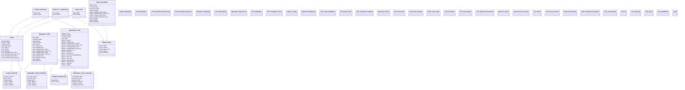

# Database model

## TeleIcare Model

```mermaid
classDiagram
    PLANTE <|-- PLANTE_SYNONYME
    PLANTE_SYNONYME <|-- PLANTE

    INGREDIENT_AUTRE <|-- INGREDIENT_AUTRE_SYNONYME
    INGREDIENT_AUTRE_SYNONYME <|-- INGREDIENT_AUTRE

    SUBSTANCE_ACTIVE <|-- SUBSTANCE_ACTIVE_SYNONYME
    SUBSTANCE_ACTIVE_SYNONYME <|-- SUBSTANCE_ACTIVE

    PARTIE_UTILE <|--|> PARTIE_PLANTE
    PARTIE_UTILE <|--|> PLANTE

    INGREDIENT_AUTRE <|--|> AUTREING_SUBSTACTIVE
    SUBSTANCE_ACTIVE <|--|> AUTREING_SUBSTACTIVE

    PARTIE_PL_A_SURVEILLER <|--|> PLANTE
    PARTIE_PL_A_SURVEILLER <|--|> PARTIE_PLANTE

    PLANTE_SUBSTANCE <|--|> PLANTE
    PLANTE_SUBSTANCE <|--|> SUBSTANCE_ACTIVE

    class PLANTE{
        ID PLTE_IDENT
        ID FAMPL_IDENT
        FCTINGR_IDENT
        STINGSBS_IDENT
        PLTE_LIBELLE
        PLTE_ORDRE
        PLTE_OBSOLET
        PLTE_COMMENTAIRE_PUBLIC
        PLTE_COMMENTAIRE_PUBLIC_EN
        PLTE_COMMENTAIRE_PRIVE
        PLTE_COMMENTAIRE_PRIVE_EN
    }
    class PLANTE_SYNONYME{
        ID SYNPLA_IDENT
        $PLTE_IDENT
        $TYSYN_IDENT
        SYNPLA_LIBELLE
        SYNPLA_ORDRE
        SYNPLA_OBSOLET
    }
    class INGREDIENT_AUTRE{
        INGA_IDENT
        STINGSBS_IDENT
        TAING_IDENT
        FCTINGR_IDENT
        INGA_LIBELLE
        INGA_LIBELLE_EN
        INGA_OBSERVATION
        INGA_COMMENTAIRE_PUBLIC
        INGA_COMMENTAIRE_PUBLIC_EN
        INGA_COMMENTAIRE_PRIVE
        INGA_COMMENTAIRE_PRIVE_EN
        INGA_DESCRIPTION
        INGA_DESCRIPTION_EN
        INGA_ORDRE
        INGA_OBSOLET
    }
    class INGREDIENT_AUTRE_SYNONYME{
        ID SYNAO_IDENT
        $TSYNAO_IDENT
        $INGA_IDENT
        SYNAO_LIBELLE
        SYNAO_ORDRE
        SYNAO_OBSOLET
    }
    class SUBSTANCE_ACTIVE{
        SBSACT_IDENT
        STINGSBS_IDENT
        TYSUBST_IDENT
        UNT_IDENT
        SBSACT_LIBELLE
        SBSACT_LIBELLE_EN
        SBSACT_COMMENTAIRE_PUBLIC
        SBSACT_COMMENTAIRE_PUBLIC_EN
        SBSACT_COMMENTAIRE_PRIVE
        SBSACT_COMMENTAIRE_PRIVE_EN
        SBSACT_NUMERO_CAS
        SBSACT_SOURCE
        SBSACT_SOURCE_EN
        SBSACT_QUANTITE_ARENSEIGNER
        SBSACT_QTE_MIN
        SBSACT_QTE_MAX
        SBSACT_NUM_EINECS
        SBSACT_APPORT_REF
        SBSACT_OBSOLET
        SBSACT_ORDRE

    }
    class SUBSTANCE_ACTIVE_SYNONYME{
        ID SYNSBSTA_IDENT
        TSYNSBSTA_IDENT
        SBSACT_IDENT
        SYNSBSTA_LIBELLE
        SYNSBSTA_ORDRE
        SYNSBSTA_OBSOLET

    }
    class MICRO_ORGANISME{
        MORG_IDENT
        FCTINGR_IDENT
        STINGSBS_IDENT
        MORG_ESPECE
        MORG_COMMENTAIRE_PUBLIC
        MORG_COMMENTAIRE_PUBLIC_EN
        MORG_COMMENTAIRE_PRIVE
        MORG_COMMENTAIRE_PRIVE_EN
        MORG_GENRE
        MORG_ORDRE
        MORG_OBSOLET
    }
    class PARTIE_PLANTE{
        PPLAN_IDENT
        PPLAN_LIBELLE
        PPLAN_LIBELLE_EN
        PPLAN_ORDRE
        PPLAN_OBSOLET

    }
    class PARTIE_PL_A_SURVEILLER{
        PLTE_IDENT
        PPLAN_IDENT
    }
    class PLANTE_SUBSTANCE{
        PLTE_IDENT
        SBSACT_IDENT
    }
    class PARTIE_UTILE{
        PLTE_IDENT
        PPLAN_IDENT
    }
    class AUTREING_SUBSTACTIVE{
        INGA_IDENT
        SBSACT_IDENT
    }

    class FORME_GALENIQUE{ }
    class TYPE_SUBSTANCE{ }
    class TYPE_SYNONYME_SUBSTACTIVE{ }
    class TYPE_SYNONYME_MICROORG{ }
    class MICROORG_SYNONYME{ }
    class TYPE_PREPARATION{ }
    class MICROORG_SUBSTACTIVE{ }
    class TYPE_INGREDIENT{ }
    class TYPE_SYNONYME_PLANTE{ }
    class FAMILLE_PLANTE{ }
    class FONCTION_INGREDIENT{ }
    class TYPE_AUTRE_INGREDIENT{ }
    class POPULATION_CIBLE{ }
    class TYPE_SYNONYME_AUTREING{ }
    class OBJECTIFS_EFFETS{ }

    class QTE_POPULATION{ }
    class POPULATION_ARISQUE{ }

    class STATUT_INGR_SUBST{ }
    class TYPE_DOCUMENT{ }
    class TYPE_DECLARATION{ }
    class TYPE_VERSION_DECLARATION{ }
    class MOTIF_DE_REFUS{ }
    class JUSTIFICATION_DE_REFUS{ }
    class STD_STATUT{ }
    class STATUT_DECLARATION{ }
    class STADE_DECLARATION{ }
    class STADE_EXAMEN_DECLARATION{ }
    class TYPE_USR_ENCOURS{ }
    class CIVILITE{ }
    class TYPE_HERITAGE{ }
    class TYPE_TRACE{ }
    class TYPE_EVENEMENT{ }
    class UNITÉ{ }


```
